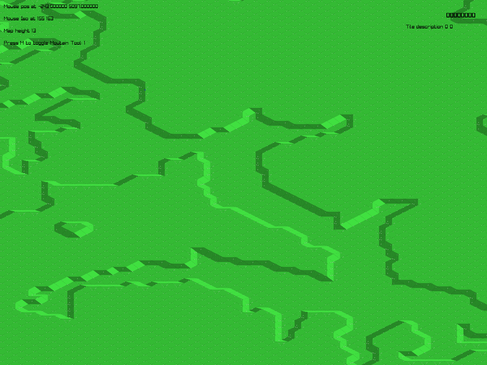
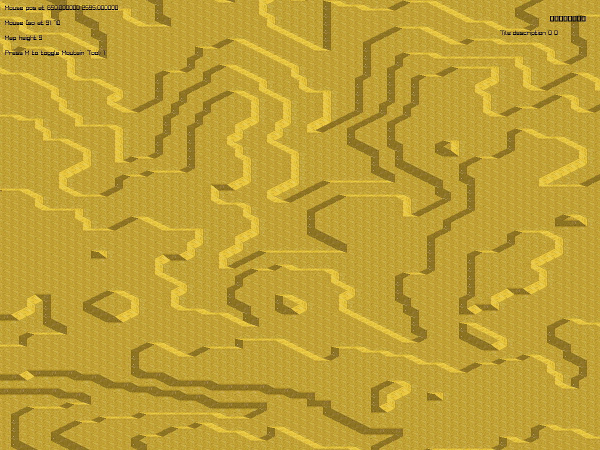

# ISO - Isometric heightmap renderer
2D isometric heightmap renderer using terrain tiles, similar to OpenTTD/OpenRCT. Can read OpenTTD heightmaps.

## What's included?
`scripts\GenerateLookupTable.py` is a python script that outputs tile description for each bit pattern from 0 to 31 (0001 1111)

`gen\generate.cpp` has a function `LoadHeightmap` that reads OpenTTD format heightmaps and returns the vertices raised and height of each tile in the map.

`tileset\tileset.h` has a lot of constants and lookup tables used to interpret and render each tile.

## How does it work?
Each tile in the map is composed of four corners and a height and is represented by two 8 bit numbers. Each bit in the corner descriptor indicates if the corners is 'raised' or not. Rendering is rather simple and is done by matching each bit pattern to a position on the spritesheet

The heightmap image assigns each vertex (or corner) a height. Ensuring that each height only differs by one point from adjacent neighbors and by two points from diagonal neighbors, each four pixels describes the geometry of a square 'tile'. Comaparing the height values relative to the lowest height in the square shows which corner to toggle. A difference of 2 means a steep slope, and the appropriate bit is set.

Editing is broken but is there, similar to OpenRCT and even ~~steals~~ borrows the terrain edit lookup tables.

## Why did you make this poor imitation of locomotives and theme parks?
I wanted to make an isometric strategy game with cliffs. Cliffs mean non continuous terrain surfaces and so I proceeded to write a heightmap renderer modelling tiles instead of individual corners. Editor sucks and game is non existent but the rendering looks somewhat cool

## Issues
Memory and CPU usage is too much for such a simple application.

Selecting tiles is broken as it doesn't account for zoom or height

Terrain generation is completely off. It just does not work and give absolutely non-sensical results. Maybe replacing the diamond square algorithm with a tuned perlin noise could fix it, but for now I'm sticking with just reading premade maps of various middle eastern city terrains instead.

There's something off with the heightmap reader as well, south and west corners are switched. Might be something with raylib, might be something with the height map format that I'm missing.

Terrain editing is also just awful. Only raising is implemented, and the mountain tool has issues with raising slopes. What OpenRCT does is raising the inital square then raising each edge in a separate operation.

## Credits
raylib is used for rendering, input. Really neat library https://www.raylib.com/

Terrain spritesheets are taken from Clint Bellanger at opengameart https://opengameart.org/content/terrain-renderer

Various heightmaps generated by bother.js http://map.personman.com/
